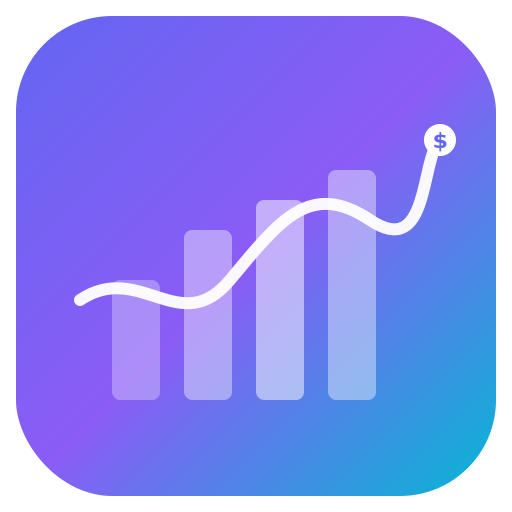

<p align="center">
  
</p>

<h1 align="center">BalanceVisor</h1>

<p align="center">
  Personal finance dashboard — accounts, budgets, transactions, investments, goals, debt tracking, and an AI assistant.<br/>
  Next.js 16 · Drizzle ORM · Supabase · Groq AI
</p>

---

## What it does

BalanceVisor is a full-stack personal finance app. You connect your bank (TrueLayer Open Banking) or add accounts manually, and the app tracks everything from daily spending to long-term investment performance. There's an AI assistant powered by Groq that can parse natural language into transactions and auto-categorise spending.

## Features

**Dashboard** — Net worth across accounts + investments, month-over-month trends, recent transactions, spending breakdown, cashflow chart, budget progress bars, and savings goals.

**Accounts** — Current accounts, savings, credit cards, investments. Balances auto-adjust when transactions are added/edited/deleted.

**Transactions** — Income/expense tracking with categories, recurring patterns (daily/weekly/biweekly/monthly/yearly), CSV import with column mapping, and data export. Split transactions supported.

**Categories** — Custom categories with colours and icons. Rule-based auto-categorisation with AI fallback (Groq) for imported or manually entered transactions.

**Budgets** — Monthly or weekly spending limits per category. Threshold alerts via browser notifications and email (Resend). Notification bell in the navbar.

**Goals** — Savings goals with target amounts, deadlines, and contribution tracking.

**Debt Tracker** — Track debts with interest rates, minimum payments, and payoff progress.

**Subscriptions** — Recurring subscription tracking.

**Reports** — Spending insights and analytics.

### AI

- **Smart Categorisation** — When no rule matches a transaction, Groq's `openai/gpt-oss-20b` picks the best category from the user's list. Falls back gracefully if the API is down or no key is configured.
- **Natural Language Transactions** — Type something like "£45 Tesco groceries yesterday" and the AI parses it into a structured transaction with the right account, category, amount, and date. Powered by the `/api/parse-transaction` route.
- **Chat Assistant** — Conversational AI in a slide-out panel for financial questions, accessible from any dashboard page.

### Investments

- **Trading 212** — Connect with your API key + secret (HTTP Basic Auth). Syncs account summary and open positions for both Live and Demo environments.
- **Manual Holdings** — Search tickers via Yahoo Finance, track quantity and cost basis. Prices auto-refresh when stale (>15 min).
- **Investment Groups** — Organise holdings into custom groups with colours and icons.
- **Portfolio View** — Total value, gain/loss, cost basis cards. Allocation pie chart, per-holding bar chart, unified holdings table.

### Open Banking

- **TrueLayer** — OAuth flow to link UK bank accounts. Accounts and transactions import automatically on connect and on every login (hourly throttle). Manual "Sync Now" button as fallback. Supports sandbox and production environments.

### PWA

Installable as a Progressive Web App on mobile and desktop. Service worker provides offline fallback, font caching, and stale-while-revalidate for static assets. Custom install prompt with dismiss-and-remember logic.

### Security

All sensitive data encrypted at rest with AES-256-GCM: account names, transaction descriptions, TrueLayer OAuth tokens, Trading 212 API credentials. Encryption key stored as an environment variable, never committed.

## Tech Stack

| Layer | Tech |
| --- | --- |
| Framework | Next.js 16 (App Router, Server Components, Turbopack) |
| Language | TypeScript |
| Database | PostgreSQL (Supabase) |
| ORM | Drizzle ORM |
| Auth | Supabase Auth (SSR) |
| AI | Vercel AI SDK v6, Groq (`openai/gpt-oss-20b`) |
| Styling | Tailwind CSS 4 |
| Components | shadcn/ui, Radix UI, Lucide |
| Charts | Recharts |
| Tables | TanStack Table |
| Banking | TrueLayer Open Banking |
| Investments | Trading 212 API, Yahoo Finance |

## Project Structure

```
src/
├── app/
│   ├── api/
│   │   ├── chat/               # AI chat assistant route (streaming)
│   │   ├── parse-transaction/  # NL → structured transaction route
│   │   └── truelayer/          # OAuth connect + callback
│   ├── auth/                   # Login, sign-up, password reset
│   ├── dashboard/
│   │   ├── accounts/
│   │   ├── budgets/
│   │   ├── categories/         # Categories + auto-categorisation rules
│   │   ├── goals/
│   │   ├── investments/        # T212 + manual holdings
│   │   ├── transactions/       # Table, CSV import/export
│   │   ├── layout.tsx          # Shell, navbar, bank sync trigger
│   │   └── page.tsx            # Overview
│   ├── onboarding/             # First-run setup wizard
│   └── page.tsx                # Landing page
├── components/
│   ├── ui/                     # shadcn/ui primitives
│   ├── BankSyncTrigger.tsx     # Background auto-sync on login
│   ├── ChatPanel.tsx           # AI assistant slide-out
│   ├── ConnectBankButton.tsx   # TrueLayer open banking dialog
│   ├── ConnectTrading212Dialog.tsx
│   ├── InstallPrompt.tsx       # PWA install banner
│   ├── ServiceWorkerRegistrar.tsx
│   └── ...
├── db/
│   ├── schema.ts               # Drizzle table definitions
│   ├── queries/                # Read-only data access
│   ├── mutations/              # Server actions (writes)
│   └── migrations/             # One-off migration scripts
├── lib/
│   ├── auto-categorise.ts      # Rule matching + AI fallback
│   ├── encryption.ts           # AES-256-GCM
│   ├── trading212.ts           # T212 API client (Basic Auth)
│   ├── truelayer.ts            # TrueLayer API client
│   ├── yahoo-finance.ts        # Quote + ticker search
│   ├── budget-alerts.ts        # Threshold checks + email
│   ├── recurring-transactions.ts
│   └── supabase/               # Server, browser, middleware clients
├── public/
│   ├── manifest.json           # PWA manifest
│   ├── sw.js                   # Service worker
│   └── icons/                  # App icons (192, 512, maskable)
└── index.ts                    # Shared DB instance
```

## Getting Started

### Prerequisites

- Node.js 20+
- A [Supabase](https://supabase.com) project (or any Postgres instance)

### Setup

```bash
git clone https://github.com/FK78/BalanceVisor.git
cd BalanceVisor
npm install
cp .env.example .env
```

Fill in `.env`:

| Variable | Required | Notes |
| --- | --- | --- |
| `DATABASE_URL` | Yes | Supabase Postgres connection string |
| `NEXT_PUBLIC_SUPABASE_URL` | Yes | Supabase project URL |
| `NEXT_PUBLIC_SUPABASE_PUBLISHABLE_KEY` | Yes | Supabase anon key |
| `NEXT_PUBLIC_SITE_URL` | Yes | `http://localhost:3000` for dev |
| `ENCRYPTION_KEY` | Yes | 32-byte hex — see below |
| `GROQ_API_KEY` | No | Enables AI categorisation + NL transactions + chat |
| `RESEND_API_KEY` | No | Email budget alerts |
| `TRUELAYER_CLIENT_ID` | No | Open banking |
| `TRUELAYER_CLIENT_SECRET` | No | Open banking |
| `TRUELAYER_SANDBOX` | No | Set `true` for sandbox mode |

Generate an encryption key:

```bash
node -e "console.log(require('crypto').randomBytes(32).toString('hex'))"
```

Push the schema to your database:

```bash
npx drizzle-kit push
```

Start the dev server:

```bash
npm run dev
```

Open [http://localhost:3000](http://localhost:3000).

## Scripts

| Command | Description |
| --- | --- |
| `npm run dev` | Dev server (Turbopack) |
| `npm run build` | Production build |
| `npm run start` | Serve production build |
| `npm run lint` | ESLint |

## Database

Managed by Drizzle ORM. Schema in `src/db/schema.ts`.

| Table | What it stores |
| --- | --- |
| `accounts` | Financial accounts with encrypted names |
| `transactions` | Income/expense records, encrypted descriptions, recurring patterns |
| `categories` | Spending categories (colour, icon) |
| `categorisation_rules` | Pattern → category mappings for auto-categorisation |
| `budgets` | Spending limits per category |
| `budget_alert_preferences` | Per-budget alert thresholds |
| `budget_notifications` | Alert dispatch history |
| `goals` | Savings goals with contributions |
| `debts` | Debt tracking with interest rates |
| `debt_payments` | Debt payment history |
| `subscriptions` | Recurring subscriptions |
| `net_worth_snapshots` | Historical net worth data points |
| `truelayer_connections` | Encrypted OAuth tokens, last sync timestamp |
| `trading212_connections` | Encrypted API key + secret |
| `manual_holdings` | Investment positions with cached prices |
| `investment_groups` | Portfolio grouping |
| `shared_access` | Account sharing between users |
| `user_onboarding` | Onboarding state and base currency |
| `default_category_templates` | Built-in category templates |

## License

MIT
